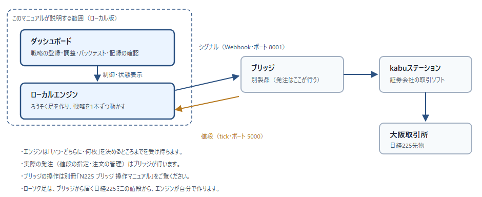

# 0-1 システム構成

**開発キットで AutoTrader Bridge を作成し、インストールした場合に、ローカルエンジンでトレードができます。**

※ ローカル版は**単体では発注できません**。必ずブリッジと組み合わせて使います。

※ ブリッジ側の操作は、別冊「N225 ブリッジ 操作マニュアル」をご覧ください。

## ローカル版が受け持つこと

- ブリッジから届く**日経225ミニの値段**から、**ろうそく足（15 分足）**を自分で作ります。
- 足が確定するたびに、登録した戦略を動かして「**買う／売る／返済する**」を判断します。
- 判断した内容を**シグナル**としてブリッジへ送ります（Webhook・ポート 8001）。
- 動いた記録を**取引記録**として残します。

## ブリッジが受け持つこと

- 受け取ったシグナルを、**実際の注文**として kabuステーションへ渡します。
- 値段の指定・注文の管理・約定の確認は、すべてブリッジ側で行われます。
- ローカル版へ**値段（tick）**を転送します（ポート 5000）。

## 2 つの製品が別になっている理由

- 発注のしくみ（証券会社とのやりとり）はブリッジが受け持ちます。共通の部品として切り出してあるため、
  **ブリッジの操作説明は別冊 1 冊で足ります**。
- ローカル版とブリッジは、**Webhook（ポート 8001）と tick（ポート 5000）**だけでつながっています。
  それ以外の結びつきはありません。
