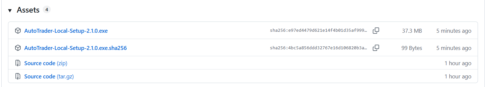

# 0-3 ダウンロードとインストール

※ **Python などの準備は要りません。**必要なものは Setup ファイルに入っています。

※ **管理者権限は要りません。**インストール先はお客様のユーザーフォルダです。

※ **発注にはブリッジ（AutoTrader Bridge）が別途必要です。**開発キットで作成し、インストールしておいてください。

---

## ① ダウンロードする

下のリンクから配布ページ（GitHub というサイトの中のページです。**会員登録は要りません**）を開きます。

▼ ダウンロードページ
**https://github.com/takezo1004/AutoTrader-Local/releases/latest**

下にスクロールすると、「**Assets**」という見出しの下にファイルが並んでいます。ダウンロードするのは、**いちばん上の `AutoTrader-Local-Setup-<版>.exe`（40 MB くらい）1 つだけ**です。`<版>` は公開されている版の番号です（例：`2.1.0`）。

一緒に並んでいる他のファイルは、次のものです。**どれもダウンロードする必要はありません。**

| 一緒に並ぶファイル | 中身 |
|---|---|
| `～.sha256` | ダウンロードしたファイルが壊れていないかを確かめるためのテキストです |
| `Source code (zip)` / `Source code (tar.gz)` | GitHub が自動で付けるソースだけのファイルです（**実行ファイルが入っていないため動きません**） |

ブラウザは通常、**`C:\Users\<お客様の名前>\Downloads`（「ダウンロード」フォルダ）**に保存します。

## ② Setup ファイルを実行する

1. ダウンロードした **`AutoTrader-Local-Setup-<版>.exe`** をダブルクリックします。
2. 「**WindowsによってPCが保護されました**」と表示されたら、**［詳細情報］→［実行］** を押します（署名のない実行ファイルに対する Windows の一般的な警告です）。
3. インストールの画面が出ます。**「デスクトップにアイコンを作成する」には、はじめから ✓ が付いています**。そのままで構いません。
4. **［インストール］** を押します。
5. 「このアプリがデバイスに変更を加えることを許可しますか」は**表示されません**（ユーザーフォルダにしか書き込まないためです）。

## ③ インストールされる場所

| 項目 | 内容 |
|---|---|
| 入る場所 | **`C:\Users\<お客様の名前>\AutoTraderLocal\`**（固定です。変更できません） |
| 管理者権限 | **不要** |
| 中身 | ローカル版の実行ファイル一式と、マニュアル（`manual\manual.html`） |

## ④ 完了後の確認

1. デスクトップに **「AutoTrader Local」** のアイコンができています。
2. スタートメニューの「AutoTrader Local」からは、**マニュアル**も開けます。
3. 起動のしかたは [1-1 起動と終了](../01_setup/01_startup.md) をご覧ください。
