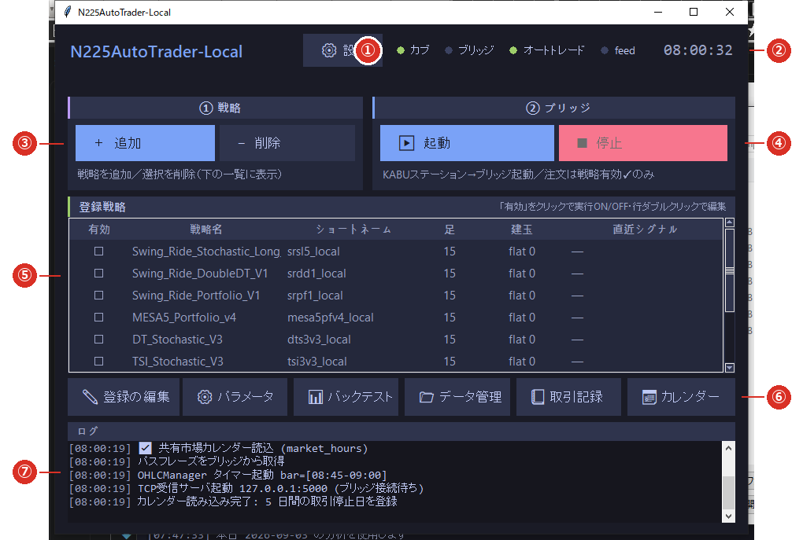

# 1-2 メイン画面

※ 起動すると出る画面です。**操作はほぼここから始まります。**

※ **画面の全体図は、この節と[1-3 設定画面](03_settings.md)の 2 か所だけ**に置いています。
   以降の節では「⑤の一覧」のように番号でご案内します。

## ① 設定

ブリッジの場所・データの保存先・画面の見やすさを設定します。詳しくは [1-3 設定画面](03_settings.md)。

## ② 状態ランプ（LED）と時計

**カブ・ブリッジ・オートトレード・feed** の 4 つが、いま動いているかを色で示します（緑＝稼働・灰＝停止）。
**3 秒ごとに更新**されます。それぞれの意味は [5-1 状態ランプとログの見方](../05_reference/01_led.md) をご覧ください。

## ③ ①戦略（追加・削除）

- **［＋ 追加］** … 配布された戦略を取り込みます（[3-1](../03_strategy/01_register.md)）。
- **［− 削除］** … ⑤で選んだ戦略の**登録を外します**（フォルダの実体は消えません・[3-6](../03_strategy/06_remove.md)）。

## ④ ②ブリッジ（起動・停止）

- **［▶ 起動］** … ブリッジを起動します。kabuステーションが未確認のときは確認のうえ起動します。
- **［■ 停止］** … ブリッジを終了します。
- 詳しくは [1-4 ブリッジとつなぐ](04_bridge.md)。

## ⑤ 登録戦略の一覧

登録した戦略が並びます。列の意味は次のとおりです。

| 列 | 意味 |
|---|---|
| **有効** | ✓＝発火したシグナルをブリッジへ**送ります**（＝注文されます）。空欄＝**記録だけ**します。 |
| **戦略名** | 取り込んだ戦略フォルダの名前（エンジンの中での戦略 ID） |
| **ショートネーム** | ブリッジへ送る戦略名（[3-2](../03_strategy/02_edit.md)） |
| **足** | 何分足で動かすか（15＝15 分足） |
| **建玉** | いま持っている数量（`flat 0`＝持っていない） |
| **直近シグナル** | 最後に発火した内容 |

- **「有効」の欄をクリックすると、その場で ON／OFF が切り替わります**（登録し直しは不要です）。
- **行をダブルクリックすると、登録の編集**（[3-2](../03_strategy/02_edit.md)）が開きます。

## ⑥ 操作ボタン

| ボタン | 内容 |
|---|---|
| ✎ 登録の編集 | ショートネーム・インターバル・説明・有効（[3-2](../03_strategy/02_edit.md)） |
| ⚙ パラメータ | 戦略の設定値をフォームで変更（[3-3](../03_strategy/03_params.md)） |
| 📊 バックテスト | 直近 6 ヶ月で成績を確認（[3-4](../03_strategy/04_backtest.md)） |
| 📁 データ管理 | ろうそく足の確認と取り込み（[2-1](../02_data/01_store.md)） |
| 📒 取引記録 | 発火した記録の確認（[4-4](../04_run/04_records.md)） |
| 📅 カレンダー | 祝日取引カレンダーの確認・更新（[2-5](../02_data/05_calendar.md)） |

- **［📅 カレンダー］が赤く ⚠ 付きになっていたら、更新が必要です**（[2-5](../02_data/05_calendar.md)）。

## ⑦ ログ

いま起きていることが色分けで流れます（注文＝緑／エラー＝赤／情報＝白）。

- **この欄の表示は、画面を閉じると消えます。**あとから見返すには
  [📒 取引記録](../04_run/04_records.md) か、ファイルに残る[ログ](../05_reference/02_files.md)をご覧ください。
- 通常の足はログに出しません。**セッションの最初と最後の足**（8:45／15:45、17:00／6:00）だけを表示します。

## 記録停止中の赤い帯

何かの理由で記録が止まると、**画面のいちばん上に赤い帯で「⚠ 記録停止中: …」**と出ます。
**正常なときは何も出ません。**出たときの対処は [6-2 記録が止まる](../06_trouble/02_record_stop.md) をご覧ください。
