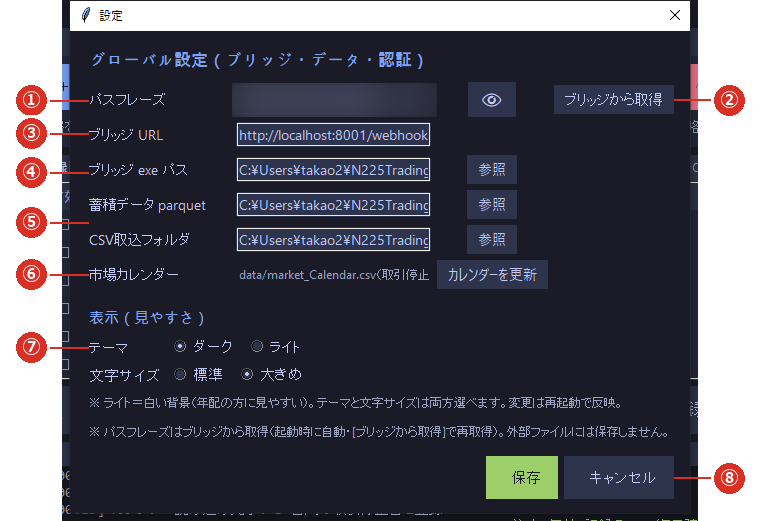

# 1-3 設定画面

※ **設定はすべてこの画面**にまとまっています。メイン画面右上の **［⚙ 設定］** で開きます。

※ **テーマと文字サイズの変更は、次に起動したときから反映**されます（開いたままでは変わりません）。

※ **パスフレーズはここでは入力できません**。ブリッジ側で決めた値を取り込んで表示するだけです。

## ① パスフレーズ

ブリッジと合言葉を合わせるための値です。**ブリッジが正**で、ローカル版は起動時に自動で取り込みます。

- **ふだんは伏せ字（●）で表示されます。**中身を見たいときは②の 👁 を押します。
- **手入力はできません**（表示専用）。
- ローカル版は**この値をファイルに保存しません**。毎回ブリッジから取り込みます。
- 戦略ごとではなく、**エンジン全体で 1 つ**です。

> **👁 で表示したまま、画面を人に見せたり撮影したりしないでください。**

## ② 表示の切り替えと［ブリッジから取得］

- **👁** … パスフレーズの表示／非表示を切り替えます。
- **［ブリッジから取得］** … いますぐ取り込み直します。ブリッジ側でパスフレーズを変えたときに押してください。
  取り込めないときは「ブリッジからパスフレーズを取得できませんでした」と表示されます
  （[1-4 ブリッジとつなぐ](04_bridge.md)）。

## ③ ブリッジ URL

シグナルの送り先です。**既定は `http://localhost:8001/webhook`** で、通常は変更しません。
ブリッジ側で待ち受けポートを変えたときだけ、それに合わせます。

## ④ ブリッジ exe パス

**［▶ 起動］でブリッジを起動するために必要**です。**［参照］**でブリッジの実行ファイルを選んでください。
ここが空、または誤っていると、ブリッジを起動できません（[6-1](../06_trouble/01_startup.md)）。

## ⑤ データの保存先（2 つ）

| 項目 | 内容 |
|---|---|
| **蓄積データ parquet** | ろうそく足を貯めるファイル。既定は `data/ohlc_live.parquet` |
| **CSV取込フォルダ** | 履歴ファイルの置き場所。既定は `data/csv_import`。取り込み時に最初に開きます |

通常は変更しません。詳しくは [2-1 蓄積ストアとは](../02_data/01_store.md)。

## ⑥ 市場カレンダー

いま読み込んでいるカレンダーの場所と、取引停止日の件数が出ます。
**［カレンダーを更新］**で更新画面が開きます（[2-5](../02_data/05_calendar.md)）。

## ⑦ テーマと文字サイズ

- **テーマ**：ダーク（黒い背景）／ライト（白い背景）
- **文字サイズ**：標準／大きめ
- **どちらも組み合わせて選べます。変更は次回の起動から反映されます。**
- 詳しくは [5-4 テーマと文字の大きさ](../05_reference/04_display.md)。

## ⑧ 保存・キャンセル

- **［保存］** … 変更を保存して閉じます。
- **［キャンセル］** … 変更を捨てて閉じます。
