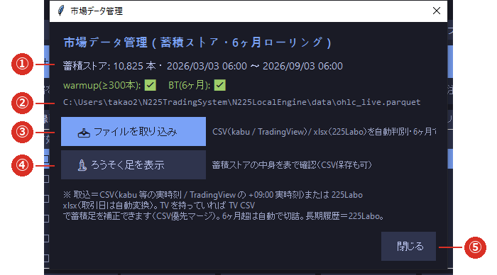

# 2-1 蓄積ストアとは

※ ローカル版は、外部のチャートサービスを使いません。
   **ブリッジから届く値段から、自分でろうそく足を作って貯めます。**その貯め場所が「蓄積ストア」です。

※ 蓄積ストアは **1 つだけ**です（`data/ohlc_live.parquet`）。バックテストもウォームアップも、
   すべてこの 1 つを使います。

メイン画面の **［📁 データ管理］**（⑥）で開きます。

## ① 本数・期間・充足サイン

いま何本たまっていて、いつからいつまでかが出ます。その下の 2 つが**足りているかどうか**の判定です。

| サイン | 意味 | 足りないと |
|---|---|---|
| **warmup(≥300本)** | 起動直後に指標を効かせるための本数 | 戦略が動き出せません（注文も記録もされません） |
| **BT(6ヶ月)** | 内蔵バックテストに必要な期間 | バックテストの成績が当てになりません |

**✅ が 2 つそろっていれば大丈夫**です。⚠ が出たら [2-2 履歴データを取り込む](02_import.md) を行ってください。

## ② 蓄積ストアの場所

ファイルの場所が表示されます。既定は `data/ohlc_live.parquet` です（[5-2](../05_reference/02_files.md)）。

## ③ ファイルを取り込み

履歴データを追加します。[2-2 履歴データを取り込む](02_import.md) をご覧ください。

## ④ ろうそく足を表示

貯まっている中身を表で確認します。[2-4 ろうそく足を確認する](04_candles.md) をご覧ください。

## ⑤ 閉じる

この画面を閉じます。

## 6 ヶ月ローリング（自動整理）

蓄積ストアは **直近 6 ヶ月ぶんだけ**を保ちます。6 ヶ月を超えた古い足は自動で切り詰められます。

- 切り詰めが行われるのは、**起動したとき・ライブの足を書き足したとき・取り込んだとき**です。
- **手作業での整理は不要です。**
- 6 ヶ月より前のデータが必要になることはありません（内蔵バックテストは直近 6 ヶ月で行うためです）。

## 足の取得元

| もと | いつ入るか |
|---|---|
| **ライブの値段（tick）** | ブリッジがつながっている間、15 分ごとに 1 本ずつ増えます |
| **取り込んだ履歴** | ［📥 ファイルを取り込み］を行ったとき |

- 取り込んだ足と貯まっていた足が重なる場合は、**取り込んだ方で上書き**されます。
- **銘柄は必ず「日経225ミニ」**です。マイクロと混ぜないでください（[2-3](03_sources.md)）。
