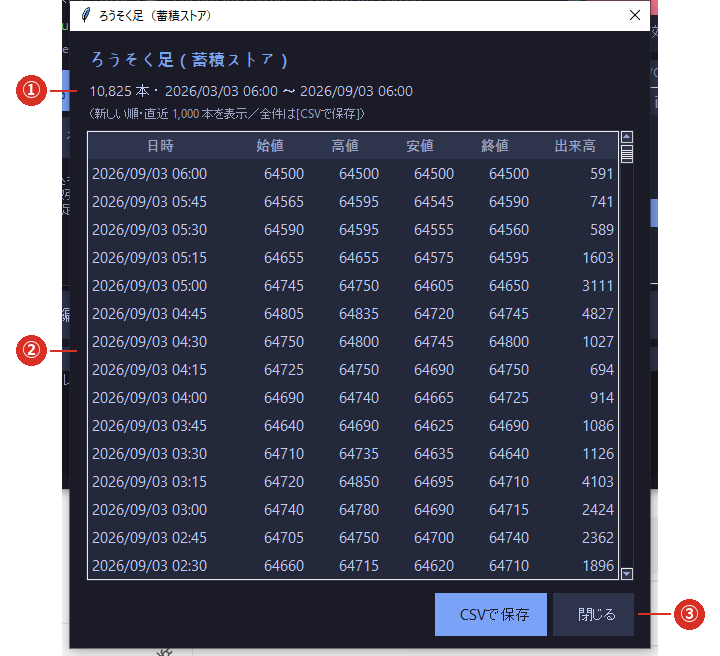

# 2-4 ろうそく足を確認する

※ 表示されるのは **新しい順に直近 1,000 本まで**です。**全件は［CSVで保存］**で書き出せます。

※ ここは**見るだけ**の画面です。値を書き換えることはできません。

［📁 データ管理］→ **［🕯 ろうそく足を表示］** で開きます。

## ① 本数と期間

蓄積ストア全体の本数と、いちばん古い足〜いちばん新しい足の日時です。

## ② 一覧（新しい順）

| 列 | 意味 |
|---|---|
| 日時 | その足が始まった時刻（日本時間） |
| 始値・高値・安値・終値 | その 15 分間の値段 |
| 出来高 | その 15 分間の出来高 |

## ③ CSVで保存

**表示中の 1,000 本ではなく、全件**を CSV に書き出します。
別のソフトで確認したいときや、控えを取っておきたいときにお使いください。

## こんなときに見ます

- **足が抜けていないか確かめたい**とき … 日時が 15 分刻みで飛んでいないかを見ます。
  ただし、**取引のない時間帯（15:45〜17:00、6:00〜8:45、土日祝）は飛んでいて正常**です。
- **取り込みがうまくいったか確かめたい**とき … いちばん古い足の日時が、取り込んだ期間まで
  さかのぼっているかを見ます。
- **出来高が 0 ばかりになっていないか**確かめたいとき（[2-2](02_import.md) の形式③の注意）。
