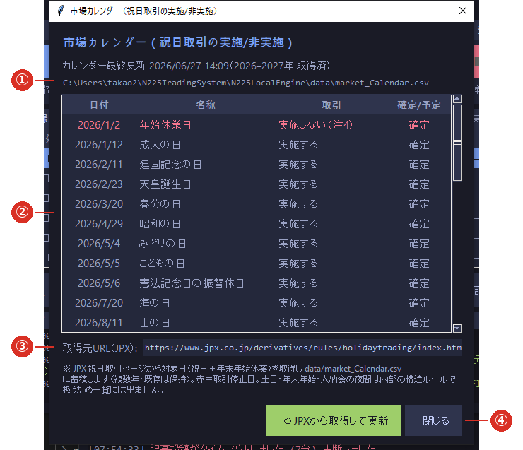

# 2-5 市場カレンダー

※ **［📅 カレンダー］ボタンが赤く ⚠ 付きになったら更新してください。**放置すると、
   休場日を取り違えて**ろうそく足がおかしくなります**。

※ **更新の反映は、次にダッシュボードを起動したときから**です（カレンダーは起動時に読み込みます）。

※ 更新には**インターネット接続**が必要です（JPX のページから取得します）。

メイン画面の **［📅 カレンダー］**（⑥）で開きます。

## なぜ必要か

日本の祝日には、**取引する日（祝日取引・実施する）**と**休む日（実施しない）**があります。
この違いは外部のカレンダーでしか分かりません。ローカル版はこのカレンダーを見て、
**その日に足を作るかどうか**を決めています。

## ① 最終更新と取得済みの年

いつ取得したか、何年ぶんを持っているかが出ます。ファイルの場所も表示されます。

## ② 祝日取引の実施／非実施

| 列 | 意味 |
|---|---|
| 日付 | 祝日・年末年始休業日 |
| 名称 | 祝日の名前 |
| 取引 | **実施する**＝その日も取引があります／**実施しない**（赤）＝休場です |
| 確定/予定 | JPX が確定として出しているか、予定か |

- 土日・年末年始・大納会の夜間は、**カレンダーに載せず内部の規則で扱います**ので一覧には出ません。

## ③ 取得元 URL（JPX）

取得しにいく先です。**通常は変更しません。**
JPX 側でページが変わってしまったときだけ、ここを直します（下記）。

## ④ JPXから取得して更新

押すと JPX のページから取得し、**複数年ぶんを足していきます**（**すでにある年は消えません**）。

## 更新の手順

1. **［📅 カレンダー］** を開きます。
2. **［↻ JPXから取得して更新］** を押します。
3. 一覧と最終更新日が新しくなれば完了です。
4. **ダッシュボードを起動し直すと反映されます。**ボタンの赤も消えます。

## いつ赤くなるか

- **その年のぶんを持っていないとき**
- **11 月以降で、翌年のぶんを持っていないとき**
- **カレンダーのファイルが無いとき**

主に**年末から年明け**にかけて赤くなります。起動時のログにも赤い文字で案内が出ます。

## 取得できないとき

[6-6 カレンダーが更新できない](../06_trouble/06_calendar.md) をご覧ください。
