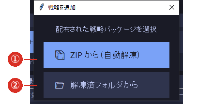

# 3-1 戦略を登録する

※ 登録できるのは、**戦略が自己完結したフォルダ**です（`strategy.py`・`config.json`・`manifest.json`
   と、その戦略が使う部品が入っているもの）。**ZIP のままでも登録できます。**

※ 登録すると、そのフォルダは `strategies/<フォルダ名>/` に**取り込まれます**（コピーされます）。
   元のファイルを消しても動きます。

※ **登録しただけでは注文されません。**注文するには「有効」に ✓ を入れます（[4-2](../04_run/02_enable.md)）。

## 手順

1. メイン画面の **［＋ 追加］**（③）を押します。

### ① ZIP から（自動解凍）

配布された ZIP をそのまま選びます。**解凍はソフトが行います。**通常はこちらをお使いください。

### ② 解凍済フォルダから

すでに解凍してある場合は、**`strategy.py` が入っているフォルダ**を選びます。

2. 続けて「登録の編集」画面が開きますので、ブリッジへ伝える情報を入力します
   （[3-2 登録の編集](02_edit.md)）。
3. **［更新］**を押すと、⑤の一覧に追加されます。

## 登録できないと言われたら

「登録エラー」と出た場合、そのフォルダは戦略として必要なものがそろっていません。
配布元にお問い合わせください。よくある原因は、**ZIP の中にもう 1 段フォルダがあり、
`strategy.py` の入っていない階層を選んでしまった**ことです。

## 複数の戦略を登録できます

- **同時に何本でも登録できます。**記録は登録した全戦略について常に残ります。
- **注文されるのは「有効」に ✓ を入れた戦略だけ**です。

## 新旧のバージョンを並べて登録できます

戦略のフォルダ名にはバージョンが入っています（例 `MESA_Stochastic_V8`）。
**登録の見分けはフォルダ名**なので、旧版と新版を**同時に登録**しておけます。

> ⚠ **両方を「有効」にすると二重に注文されます。**有効にするのは、必ずどちらか一方だけにしてください。

## 動いている最中に登録しても止まりません

運用中に戦略を足しても、**画面は固まらず、ほかの戦略も止まりません**。
ログに「差分リロード：バックグラウンドで warmup 中…」→「差分リロード完了（他戦略は無停止）」
と出れば、その戦略が使えるようになっています。
