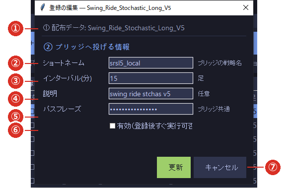

# 3-2 登録の編集

※ ここで入力するのは、**ブリッジへ伝えるための情報**です。戦略の中身（売買のしかた）は変わりません。

※ **ショートネームとインターバルの組み合わせで、ブリッジは戦略を見分けます。**
   ブリッジ側の戦略登録と**同じ値**にしてください（ブリッジのマニュアル 2-1）。

※ 開き方は 2 つ。⑤の一覧で**行をダブルクリック**するか、戦略を選んで **［✎ 登録の編集］**（⑥）です。

## ① 配布データ

取り込んだ戦略フォルダの名前です。**これがエンジンの中での戦略 ID** になります。変更できません。

## ② ショートネーム

**ブリッジへ送る戦略名**です（必須）。ブリッジ側に登録した名前と**一致させてください**。
一致していないと、ブリッジが受け取っても「知らない戦略」として扱われます。

## ③ インターバル（分）

**何分足で動かすか**です。整数で入力します（15 分足なら `15`）。
**ブリッジ側の登録と一致させてください。**

## ④ 説明

任意の覚え書きです。空欄でも構いません。

## ⑤ パスフレーズ

ブリッジと合わせる合言葉です。**ここは表示だけ**で、値は設定画面から取り込まれます
（[1-3 設定画面](../01_setup/03_settings.md) ①）。**戦略ごとではなく、エンジン全体で 1 つ**です。

## ⑥ 有効（登録後すぐ実行可否を ON）

✓ を入れると、**登録した直後から注文が出る状態**になります。
様子を見てから始めたいときは、**ここは空のまま**にしてください（記録だけが残ります）。
あとから⑤の一覧でいつでも切り替えられます（[4-2](../04_run/02_enable.md)）。

## ⑦ 更新・キャンセル

- **［更新］** … 入力を保存します。ショートネームが空、またはインターバルが整数でないと保存できません。
- **［キャンセル］** … 変更を捨てて閉じます。

## 保存したあと

運用中に保存しても、**その戦略だけが裏で作り直され、ほかの戦略は止まりません**。
ログに「差分リロード」と出て、数秒で終わります。
