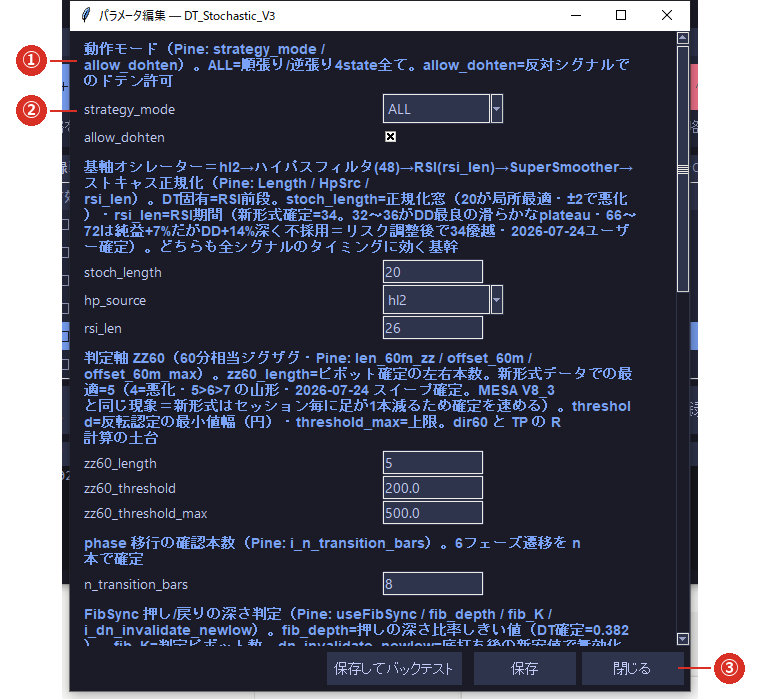

# 3-3 パラメータを調整する

※ **配布された戦略は、そのままでも動きます。**分からない項目は変えないでください。

※ 変えた値は**すぐ運用に反映されます**（保存した戦略だけが裏で作り直されます）。

※ **変える前に、いまの成績を[バックテスト](04_backtest.md)で控えておく**ことをおすすめします。

⑤の一覧で戦略を選び、**［⚙ パラメータ］**（⑥）で開きます。

## ① 説明

**その下にある入力欄が何を変えるものか**の説明です。戦略を作った人が書いています。
`Pine: rsi_len` のような書き方は、**もとの Pine スクリプトでの名前**です。

## ② 入力欄

戦略の設定値です。項目は戦略によって違います。

| 見た目 | 入力のしかた |
|---|---|
| 文字が入る欄 | 数値や文字をそのまま入力します |
| ✕ が付くマス | チェックボックスです。クリックで ON／OFF します |
| ▼ が付く欄 | 決められた選択肢から選びます |

- **数値の欄に文字を入れると保存できません。**
- 項目が多い戦略では、**画面を下にスクロール**すると続きがあります。

## 複数のサブ戦略を束ねた戦略（合成戦略）

いくつかの戦略を 1 つに束ねた戦略では、画面の上に**タブ**が並びます。
**共通のタブ**と、**サブ戦略ごとのタブ**を切り替えて設定します。
タブ列の右端に **［🔄 自動調整（再最適化）］** が出る戦略もあります（[3-5](05_reopt.md)）。

## ③ 保存してバックテスト・保存・閉じる

| ボタン | 動き |
|---|---|
| **［保存してバックテスト］** | 保存したうえで、そのまま[バックテスト](04_backtest.md)を実行します |
| **［保存］** | 保存します。画面は開いたままです |
| **［閉じる］** | 保存せずに閉じます |

## 保存時に行われる処理

- 変更は `config.json` に書かれます。
- **保存した戦略だけ**が裏で数秒かけて作り直されます（ログに「差分リロード」と出ます）。
- **ほかの戦略は止まりません。画面も固まりません。**
- 作り直しが終わるまで、その戦略は新しい判断をしません（注文もしません）。

## 元に戻す方法

**変更前の値を控えておいてください。**このソフトに「元に戻す」ボタンはありません。
分からなくなったときは、配布された ZIP から**登録し直す**のが確実です（[3-1](01_register.md)）。
