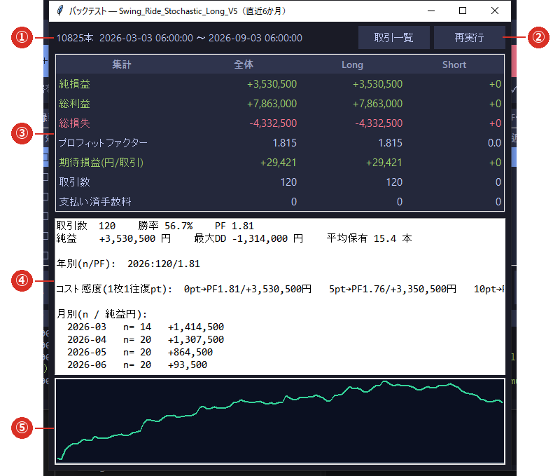
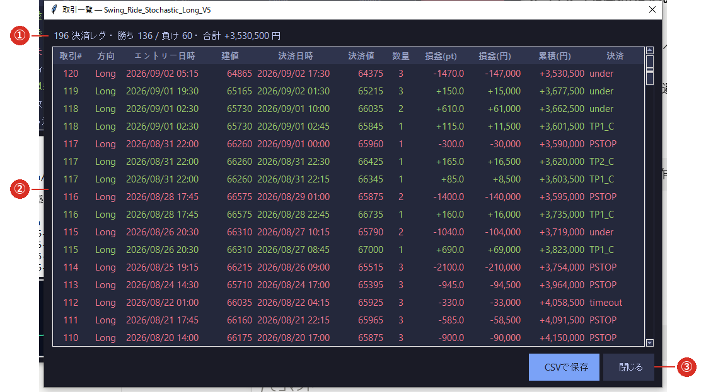

# 3-4 内蔵バックテスト

※ 使うのは**貯まっているろうそく足（直近 6 ヶ月）**です。**データが 6 ヶ月に足りないと成績は当てになりません**
   （[2-2 履歴データを取り込む](../02_data/02_import.md)）。

※ ここでの成績は**過去にこう動いたはず**という計算です。**将来を保証するものではありません。**

※ 実行中は少し時間がかかります（戦略とデータ量によります）。

⑤の一覧で戦略を選び、**［📊 バックテスト］**（⑥）で開きます。

## ① 使ったデータの本数と期間

何本のろうそく足を使い、いつからいつまでを計算したかが出ます。
**ここが 6 ヶ月に足りていなければ、まずデータを取り込んでください。**

## ② 取引一覧・再実行

- **［取引一覧］** … 1 回ずつの売買を表で見ます（下記）。
- **［再実行］** … もう一度計算し直します（パラメータを変えたあとなど）。

## ③ 集計（全体・Long・Short）

| 項目 | 意味 |
|---|---|
| **純益** | 総利益から総損失を引いた金額 |
| **総利益／総損失** | 勝った取引の合計／負けた取引の合計 |
| **プロフィットファクター** | 総利益 ÷ 総損失。**1 を超えていれば勝ち越し** |
| **期待損益（円/取引）** | 1 取引あたりの平均 |
| **取引数** | 期間中の取引回数 |
| **支払い済み手数料** | 計算に入れた手数料 |

「全体」「Long（買い）」「Short（売り）」に分けて表示されます。
**買いだけの戦略では Short の列がすべて 0** になります。

## ④ 内訳

- **勝率・最大DD・平均保有** … 最大DD＝いちばん落ち込んだときの金額。平均保有＝何本ぶん持っていたか。
- **年別・月別** … 期間ごとの取引数と純益。**特定の月だけで稼いでいないか**を見ます。
- **コスト感度** … 1 枚 1 往復あたりのコストを **0pt / 5pt / 10pt** としたときの成績。
  **コストを増やしても成り立つか**を見るところです。

## ⑤ 損益曲線

期間中の損益の推移です。**右肩上がりで、途中の落ち込みが小さい**ほど安定しています。

## 取引一覧

② の［取引一覧］で開きます。

### ① 集計

決済したレグの数・勝ち負けの数・合計損益です。

### ② 1 行＝1 決済レグ

分割して返済した場合は、**返済ごとに 1 行**になります（取引# が同じ行が複数並びます）。
「決済」の列には**返済した理由**（利食い・損切りなど）が入ります。

### ③ CSV で保存

一覧を CSV に書き出します。表計算ソフトで詳しく調べたいときにお使いください。

## 実際の売買との違い

- バックテストは**貯まっている足**で計算します。実際の取引では、**ブリッジが値段を指定して発注**するため、
  **約定しない・値段がずれる**ことがあります。
- そのため、**バックテストの成績と実際の損益は一致しません。**
  突き合わせて確かめるために、[取引記録](../04_run/04_records.md)が残されています。
