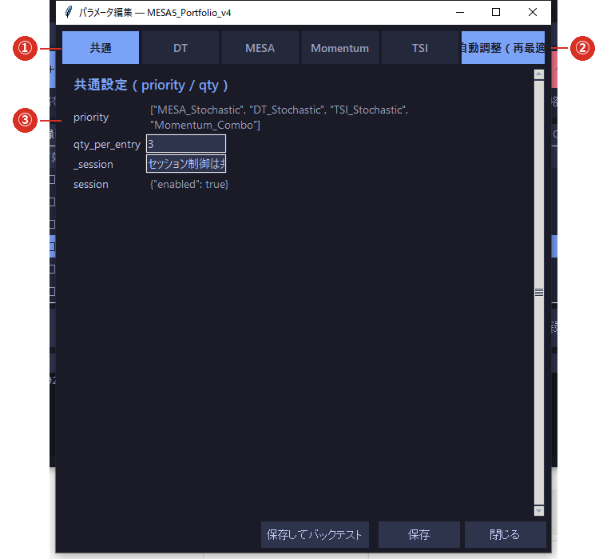

# 3-5 自動調整（再最適化）

※ **この機能に対応した戦略にだけ**ボタンが出ます。対応していない戦略では表示されません
   （押しても「この戦略は自動調整に未対応です」と出ます）。

※ **計算した結果は、そのままでは反映されません。**必ず内容を見て、ご自身で**承認**してから適用されます。

※ 計算にはしばらく時間がかかります。**取引時間中は避けてください**（パソコンが重くなります）。

## ① 共通タブとサブ戦略のタブ

いくつかの戦略を束ねた戦略（合成戦略）では、**共通の設定**と**サブ戦略ごとの設定**がタブに分かれます。

## ② 自動調整（再最適化）

タブ列の右端にあります。押すと、**直近のデータで良い設定値を探して提案**します。

## ③ 選んだタブの設定

タブを切り替えると、そのサブ戦略の設定値が表示されます。

## 操作手順

1. ⑤の一覧で戦略を選び、**［⚙ パラメータ］**（⑥）を開きます。
2. タブ列の右端に **［🔄 自動調整（再最適化）］** があれば押します。
3. 「提案を計算中…」と表示されます。**終わるまでお待ちください。**
4. **いまの値（old）と提案する値（new）**が表で並びます。
5. 内容に納得できたら **［承認して適用］** を押します。納得できなければ **［閉じる］** で何も変わりません。

## 処理の内容

- **直近のデータで設定値の組み合わせを試し**、良かったものを提案します。
- そのとき、**期間を 2 つに分けて確かめます**（前半で悪くなっていないか・後半で良くなっているか）。
  **両方を満たしたものだけ**が提案されます。過去に合わせすぎた設定を避けるためです。
- 良くなるものが見つからなければ「**変更なし（現行維持）**」と表示されます。**これも正常な結果です。**

## ご利用上の注意

- **万能ではありません。**提案どおりにすれば必ず良くなる、というものではありません。
- 適用したら、**［📊 バックテスト］で前後の成績を見比べて**ください（[3-4](04_backtest.md)）。
- **適用前の値は控えておいてください。**元に戻すボタンはありません。
