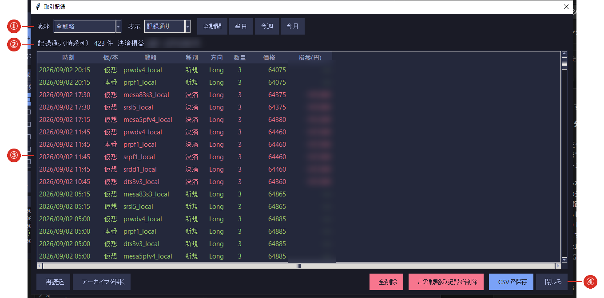
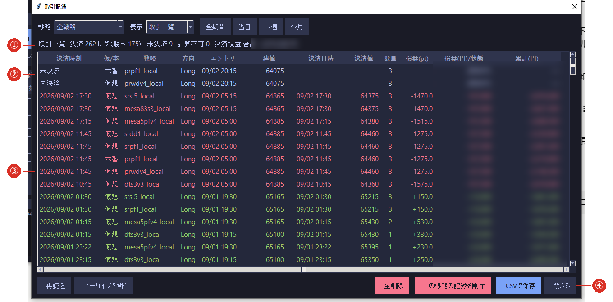

# 4-4 取引記録

※ 記録に残るのは **エンジンが動いている間に「発火」した売買**です。
   **注文したかどうか・「有効」かどうかは関係ありません。**

※ 記録は**閉じても・再起動しても残ります**（⑦のログ欄とは別物です）。

※ **損益は戦略が計算した値**です。実際の約定と一致しないことがあります（[4-2](02_enable.md)）。

メイン画面の **［📒 取引記録］**（⑥）で開きます。

## ① 絞り込み（戦略・表示・期間）

| 項目 | 内容 |
|---|---|
| **戦略** | 「全戦略」または 1 つの戦略に絞ります |
| **表示** | **記録通り** ／ **取引一覧** の切り替え（下記） |
| **期間** | 全期間／当日／今週／今月 |

## ② 件数と合計

いま表示している範囲の件数と、決済損益の合計です。

## ③ 発火イベントの一覧（新しい順）

| 列 | 意味 |
|---|---|
| **時刻** | 発火した時刻 |
| **仮/本** | **本番**＝「有効」で注文したもの／**仮想**＝記録だけのもの |
| **戦略** | ショートネーム |
| **種別** | 新規（建てた）／決済（返した） |
| **方向** | Long（買い）／Short（売り） |
| **数量・価格** | 枚数と値段 |
| **損益(円)** | 決済のときだけ入ります |

## ④ 再読込・アーカイブ・削除・CSV

- **［再読込］** … 最新の記録を読み直します。
- **［アーカイブを開く］** … 退避された過去の記録を見ます（[4-5](05_archive.md)）。
- **［全削除］／［この戦略の記録を削除］** … [4-5](05_archive.md) をご覧ください。
- **［CSVで保存］** … いま表示中の内容を CSV に書き出します。

## 2 つの表示

### 記録通り

**発火したイベントを 1 つずつ、起きた順**に並べます（新しいものが上）。
「いつ何が起きたか」をそのまま追いたいときに使います。

### 取引一覧

**新規と決済を組にして**表示します。

#### ① 決済レグ数・勝ち・未決済・合計

#### ② 未決済（保有中）の行

決済し切っていない建玉です。決済時刻の欄が「未決済」、損益の欄が「(保有中)」になります。

#### ③ 決済済みの行

**建値・決済値・損益・累計**が並びます。分割して返済した場合は、**返済ごとに 1 行**です。
損益が記録されていない決済は、**「計算不可（損益記録なし）」**と理由が表示されます（行は消えません）。

#### ④ ボタン列

「記録通り」と同じです。

## 記録の対象

**記録されるのは、エンジンが足を受け取って動いている間に発火したもの**だけです。

| 状態 | 記録 |
|---|---|
| ダッシュボードを起動している・feed が来ている | **される** |
| ウォームアップ中（起動直後の作り直し） | **されない**（注文もしません） |
| ダッシュボードを閉じている・パソコンが止まっている | されない |
| 赤い帯（記録停止中）が出ている | されない（[6-2](../06_trouble/02_record_stop.md)） |
| feed ランプが灰（値段が届いていない） | されない（[6-4](../06_trouble/04_feed.md)） |
| 市場が閉じている時間帯 | **取引が無いので、そもそも発火しません**（正常です） |

**取りこぼしを防ぐには、市場が開いている間ずっと「ダッシュボード起動＋赤い帯なし＋feed 緑」を
保つこと**です。

## ログ欄との違い

| | ⑦のログ欄 | 取引記録 |
|---|---|---|
| 残るか | **閉じると消えます** | **残ります** |
| 中身 | 足の確定・接続・エラーなど全般 | 発火した売買だけ |
| どこに保存されるか | `data/logs` に別途保存されます | `app/state/trade_log.jsonl` |
